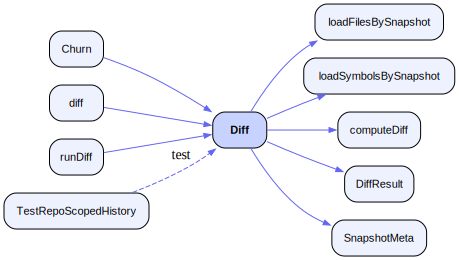

# Technical Reference: RunEcho

## Architecture

RunEcho is a small Go program built around one idea: a **deterministic structural
fact table** for source code, plus durable history of it, queryable by humans
(CLI) and by AI agents (MCP).

```
                 ┌─────────────┐
  source files ─▶│  parser     │  per-language: imports/functions/classes/exports
                 └──────┬──────┘
                        ▼
                 ┌─────────────┐
                 │  ir         │  IR{Version, RootHash, Files{path: {Hash, ...}}}
                 │  (hashed)   │  deterministic SHA-256 root hash
                 └──────┬──────┘
                        ▼
                 ┌─────────────────────────────┐
                 │  snapshot (central store)   │  ~/.runecho/history.db (SQLite/WAL)
                 │  repos · snapshots · files  │  versioned schema, integrity-checked
                 │  · symbols                  │
                 └──────┬───────────────┬───────────────┬──────┘
                        │               │               │
           runecho-ir (CLI)   runecho-mcp (stdio MCP)   runecho-guard
                                                        (pre-commit / PreToolUse hook)
```

Key design decisions:

- **Determinism over fuzziness.** No embeddings, no similarity. The IR is a flat,
  sorted, hashable fact table. "Same code → byte-identical IR" is a tested
  guarantee, which is what lets an agent trust the answer.
- **One central store, not per-repo DBs.** A single `~/.runecho/history.db` holds
  every enrolled repo's history. One integrity boundary, one backup, atomic
  cross-repo queries.
- **Stable repo identity.** Snapshots carry a `repo_id` foreign key to a `repos`
  table, so a repo keeps its identity (and history) even if its path moves. Reads
  scope by `repo_id`, never by the volatile root-path string.
- **The oracle never answers from a cache.** `runecho-mcp` and the CLI's
  `snapshot`/`diff`/`verify`/`truth-trail` build a *fresh* IR on every call.
  `.ai/ir.json` is only an incremental working artifact, written/updated by the
  bare `runecho-ir [root-path]` invocation.

### Example: the `Diff` call trail, drawn by Codeshot

RunEcho's core question is "what structurally changed between two snapshots" —
answered by `Diff` in `internal/snapshot/diff.go`. The diagram below was not
hand-drawn: it was generated from the live CodeGraph index with
[Codeshot](https://github.com/inth3shadows/codeshot)
(`codeshot Diff --path . --format svg --out docs/diff-callgraph.svg`) and
committed verbatim.



Reading it: `Diff` loads both sides being compared (`loadFilesBySnapshot`,
`loadSymbolsBySnapshot`), hands them to `computeDiff`, and packages the answer
(`DiffResult`, `SnapshotMeta`). Its callers are the three surfaces that need a
structural diff — `runDiff` (the CLI `diff` subcommand), the MCP `diff` oracle
tool, and `Churn`, which reuses `Diff` across the last N snapshots. The
`TestRepoScopedHistory` edge is dashed because Codeshot draws test-only callers
dashed, so production call paths stand out. Regenerate any time with the command
above.

## User-Facing Surfaces

RunEcho has three distinct surfaces. They share the same store and the same core
IR format, but they solve different problems:

| Surface | Primary user | Job |
|---|---|---|
| `runecho-ir` | Human operator | Enrol repos, capture snapshots, inspect drift/churn, generate change receipts (`truth-trail`), validate claims, manage the store |
| `runecho-mcp` | AI agent / MCP host | Ask read-only structure, diff, hash, status, and health questions |
| `runecho-guard` | Human + AI agent | Stop or question edits that reference symbols outside known repo truth |

The intended operating model is: use `runecho-ir` to maintain the baseline, let
the MCP server answer live questions, and keep the guard close to edit time.

## Repo Identity and Source Roots

Each enrolled repo has three related identity values:

- `path`: the enrolled working-tree path
- `source_root`: the directory RunEcho should actually walk when building IR
- `common_dir`: the canonical git-common-dir used to recognize worktrees of the
  same repo quickly and consistently

Most repos use the same directory for `path` and `source_root`. `--source-root`
exists for nonstandard layouts, especially bare-repo or worktree setups where
the place you enrol is not the place you want parsed.

`repo reindex` already honors `EffectiveSourceRoot()`. Some compare-style CLI
commands still resolve live code from the caller's root path, so for unusual
layouts you should run them from the enrolled source tree until surface parity
is fully finished.

## File Descriptions

| Path | Role | Depends on |
|---|---|---|
| `internal/parser/{go,js,python,shell,rust,ruby}.go` | Extract top-level structure per language via the `Parser` interface | — (leaf) |
| `internal/ir/generator.go` | Walk a tree, parse files, build IR; `Generate` (full) and `Update` (incremental, hash-gated) | `parser` |
| `internal/ir/hasher.go` | `HashFile`, `HashBytes`, `ComputeRootHash` (sorted `path:hash` pairs → SHA-256) | — |
| `internal/ir/storage.go` | Canonical JSON marshal (sorted) + `Save`/`Load` of `.ai/ir.json` | — |
| `internal/snapshot/db.go` | `Open` (pragmas, `quick_check`, migrations), versioned `migrate`, `Health`, `BackupTo` | `ir` |
| `internal/snapshot/registry.go` | `repos` table CRUD: `EnrollRepo`, `GetRepoBy*`, `ListRepos`, `TouchRepo`, `PurgeRepo` | — |
| `internal/snapshot/snapshot.go` | `SaveSnapshot`, `List`, `GetByID`, `GetLatestByLabel` (all repo-scoped) | `ir` |
| `internal/snapshot/diff.go` | `Diff`, `DiffLive`, formatters | — |
| `internal/snapshot/churn.go` | `Churn` over the last N snapshots | — |
| `internal/mcp/server.go` | Minimal stdio JSON-RPC 2.0 MCP server | — |
| `internal/mcp/tools_oracle.go` | The six oracle tools, wired to `ir` + `snapshot` | `ir`, `snapshot` |
| `internal/guard/diff.go` | Parse `git diff --cached --unified=0` into added lines | — |
| `internal/guard/extract.go` | Per-language definition/reference/import extraction + builtin sets | — |
| `internal/guard/validate.go` | Two-pass validation: collect new defs, then flag unresolved refs | — |
| `internal/guard/suggest.go` | Deterministic "did you mean" via Levenshtein (distance ≤ 2) | — |
| `internal/guard/filescope.go` | File-scope resolution: a name real repo-wide but unresolvable in *this* file | — |
| `internal/guard/dropped_import.go` | An import removed by an edit that is still used below it | — |
| `internal/guard/depqualified_go.go` | Go external/stdlib package export sets, for qualified-call validation | `depindex` |
| `internal/depindex/` | Memoized export sets for Go module-cache dependencies (`$RUNECHO_HOME/depcache`) | — |
| `internal/contract/contract.go` | Edit-scope contract format + parsing (#12 D1) | — |
| `internal/guardstats/` | `guard-stats` aggregation and `fpreport` approval-rate analysis over `decisions.jsonl` | — |
| `internal/claims/claims.go` | Extract code-symbol references from prose for `validate-claims` and `truth-trail --text` | — |
| `internal/gitutil/gitutil.go` | Canonical git-common-dir resolution — the V4 repo-lookup key | — |
| `internal/store/dir.go` | Single source of truth for `$RUNECHO_HOME` / `~/.runecho` | — |
| `internal/store/atomicwrite.go`, `lock.go` | Temp-file-then-rename writes; cross-process advisory `flock` | — |
| `cmd/runecho-ir/main.go` | CLI entrypoint and subcommand dispatch | `ir`, `snapshot` |
| `cmd/runecho-ir/contract.go` | `contract list\|show\|activate\|deactivate\|check` | `contract`, `snapshot` |
| `cmd/runecho-ir/fpreport.go` | `fpreport` — observed guard false-positive (approval) rate | `guardstats` |
| `cmd/runecho-ir/mapcmd.go` | `map` — symbol inventory / `locate`'s CLI counterpart | `ir` |
| `cmd/runecho-mcp/main.go` | Opens the store, registers the oracle, serves stdio | `mcp`, `snapshot` |
| `cmd/runecho-guard/main.go` | Guard entrypoint: pre-commit mode + `--hook-mode`, 3-tier repo resolution | `guard`, `snapshot`, `gitutil` |
| `cmd/runecho-guard/{dangling,duplicate,filescope,qualified,depqualified,contract}.go` | The opt-in extra checks (all default OFF — see Configuration) | `guard` |
| `cmd/runecho-guard/declog.go` | Appends `decisions.jsonl`; records the guard binary version (`gv`) | — |
| `cmd/runecho-guard/learnedallow.go` | C3 learned-allow store with count threshold + TTL decay | `store` |

## The MCP Oracle Tools

All tools are read-only and resolve a repo by its enrolled **name**. The server
speaks newline-delimited JSON-RPC 2.0 (`initialize`, `tools/list`, `tools/call`).

| Tool | Args | Returns |
|---|---|---|
| `structure` | `repo`, optional `paths` (globs, `**` crosses directories) + `detail` (`tree`\|`symbols`\|`hashes`\|`full`) | Files + symbols of the live IR, with counts; per-file `refs` list the bare call sites within that file. Scope with `paths` and drop to `detail: "tree"` to keep responses small on a large repo. `symbols` (default) omits each symbol's content hash — 60% of the payload and unread by agents (#224); `hashes` restores it for drift work, though `hash`/`diff`/`status` answer that far more cheaply |
| `diff` | `repo`, optional `a`+`b` (snapshot ids) or `since` (label) + `session` | Structural drift; default is latest snapshot vs live |
| `hash` | `repo` | Deterministic root hash + file count |
| `status` | `repo` | last-indexed, staleness, parse errors, coverage %, snapshot count, latest stored hash, file cap |
| `health` | — | Schema version, live integrity check, repo count, db path |
| `locate` | `repo`, optional `symbol` + `kind` + `offset` | Symbol → `file:line` (+ short body hash). A named lookup matches by exact name, prefix, or last dotted segment and searches every kind, so zero matches is definitive; omitting `symbol` lists all (functions+classes by default, capped — page with `offset`/`next_offset`) |

A `diff` with explicit `a`/`b` rejects snapshot ids that belong to a different
repo — diffs never cross repo boundaries.

## The Guard (`runecho-guard`)

The guard validates *new* code against the enrolled repo's indexed symbols and
flags bare function calls that resolve to nothing — the signature shape of a
hallucinated API. Two modes share the same validation core:

- **Pre-commit mode** (default; installed by `install.sh --hook`). Reads
  `git diff --cached --unified=0`, validates added lines, and exits 1 with a
  `file:line: symbol (did you mean "X"?)` report if violations are found.
- **Hook mode** (`--hook-mode`). A Claude Code `PreToolUse` hook for
  `Edit|Write|MultiEdit`. Reads the tool-call JSON on stdin, validates the new
  content, and answers via the `hookSpecificOutput` contract: unresolved symbols
  → `permissionDecision: "ask"` with the violation list as the reason. The guard
  never auto-approves — on a clean check it emits nothing and defers to the
  normal permission flow.

Validation is a two-pass static check: first collect every definition the change
itself introduces (plus the on-disk file's own definitions and imports, so local
helpers don't false-positive), then flag unresolved references that appear in
neither the IR, the new definitions, the per-language builtin sets, nor
`.runechoguardignore` (one literal symbol or glob pattern per line — `track*`
allowlists a whole family of bare global names — `#` comments, at the repo
root). Three reference shapes are checked, all unqualified — `Foo(`, never
`pkg.Foo(`:

- **bare calls** — `Foo(x)`, including generic instantiations (`Foo[int](x)` in
  Go, `Foo<T>(x)` in TS/JS)
- **type annotations** (JS/TS) — the `param: TypeName` shape
- **SCREAMING_SNAKE constant references** (Python) — uses of module-level
  `UPPER_CASE` names

### Opt-in checks (all default OFF)

The hallucination check above is the guard's always-on core. Seven further
checks ship behind env flags, each gated so it can be dogfooded before it
becomes default behaviour. All use the same ask-posture and fail-open rules; a
single ask can carry several at once, and the decision log joins their names
with `+` (`violations+dangling`).

| Check | Flag | Asks when |
|---|---|---|
| E1 dangling refs | `RUNECHO_GUARD_DANGLING` | The edit deletes a symbol definition other files still reference |
| Dropped import | `RUNECHO_GUARD_DROPPED_IMPORT` | The edit removes an import that is still used below it |
| E5 duplicate symbol | `RUNECHO_GUARD_DUPLICATE` | **Go only.** The edit defines a name already defined by another non-test Go file in the *same directory* (= the same package, so a real compile collision). Cross-directory and non-Go matches are not collisions and are skipped. Suppressed when both files carry a build constraint — `//go:build unix` / `!unix`, or a GOOS/GOARCH filename suffix — since the compiler never sees both (#225) |
| Same-repo qualified | `RUNECHO_GUARD_QUALIFIED` | (Go) `pkg.Foo()` where `pkg` is an internal package of this module and has no `Foo` |
| Dependency qualified | `RUNECHO_GUARD_DEPS_GO` | (Go) `http.Gett()` where the imported external/stdlib package has no such export. Abstains under `go.work`, behind a `replace`, or when the package is not in the module cache |
| File-scope resolution | `RUNECHO_GUARD_FILESCOPE` | (Python) A name that resolves repo-wide but not inside *this* file — the "real symbol, wrong scope" case |
| Edit-scope contract | `RUNECHO_GUARD_CONTRACT` | The edit falls outside the session's active contract (#12 D1/D2) |

C3 **learned-allow** (`RUNECHO_GUARD_LEARN`) is not a check but a suppressor:
after a symbol is approved `RUNECHO_GUARD_LEARN_N` times (default 2) it stops
being asked about, and the entry decays if not re-approved within
`RUNECHO_GUARD_LEARN_TTL_DAYS` (default 14) — a sliding window rather than a
one-way ratchet, so a symbol approved once and later deleted does not stay
allowed forever. Only *hallucination-origin* approvals train it: approving a
dangling or duplicate ask says the edit was fine, never that the name resolves.

**Fail-open by design.** Not installed, repo not enrolled, no snapshot, DB
error, or a hung git subprocess (2s cap, `gitutil.Timeout`) all degrade to
silence — the guard blocks hallucinations; it must never block work. Repo
resolution is three-tier: git-common-dir key (O(1), schema V4) → enrolled-path
lookup → worktree-list scan, backfilling `common_dir` on a hit so the next fire
takes the fast path.

A **panic** is covered by the same rule: because a Go panic exits status 2 and
Claude Code reads a PreToolUse exit of 2 as *block this tool call*, both stdio
hook modes run under `deferOnPanic`, which buffers the response, discards it on
panic, warns on stderr, and exits 0. Repo-derived file paths reaching the agent
(dangling referrers, duplicate locations, the pre-commit report) pass through
`sanitizeReasonPath` first — see [SECURITY.md](SECURITY.md) for why.

Residual false positives are intrinsic to shallow static analysis
(dynamically-assigned callables, locals): measured ~0% for Go, ~0.5% for JS,
~5% for Python across the guard test corpus (`internal/guard/testdata/corpus/*.json`)
— which is why hook mode asks instead of denying.

## Storage Schema

SQLite at `~/.runecho/history.db` (override dir with `RUNECHO_HOME`). Schema
version is tracked in `PRAGMA user_version`; migrations run in order inside
transactions on `Open`, so an interrupted upgrade can never leave a torn schema.

- `repos(id, name UNIQUE, path UNIQUE, source_root, common_dir, file_cap, enrolled_at, last_indexed, parse_errors, supported_seen)`
  — `common_dir` is the git-common-dir, a stable identity shared by every
  worktree of a repo; the guard keys lookup on it so bare-repo worktrees resolve
  in O(1) instead of scanning `git worktree list`.
- `snapshots(id, repo_id → repos, session_id, label, timestamp, root, root_hash)`
- `files(id, snapshot_id → snapshots, path, content_hash)`
- `symbols(id, file_id → files, name, kind)`
- `refs(id, file_id → files, name UNIQUE per file)` — bare call sites per snapshot file (IR v2).
  Kept separate from `symbols` on purpose: refs are derived *usage* facts, not
  declared structure, so they never widen the guard's known-symbol set or add
  noise to structural diffs. Extraction is shared with the guard
  (`guard.ExtractRefs`), so index-time facts and edit-time validation can
  never disagree about what counts as a call.
- `contracts(...)` — the active edit-scope binding per session (V9, #12 D1).

Schema history (`internal/snapshot/db.go`, `SchemaVersion = len(migrations)`):

| V | Adds |
|---|---|
| 1 | baseline `snapshots`/`files`/`symbols` |
| 2 | central-store `repos` registry + `snapshots.repo_id` |
| 3 | split `repos.path` (lookup key) from `source_root` |
| 4 | `common_dir` — the stable cross-worktree lookup key |
| 5 | `supported_seen` — honest coverage denominator |
| 6 | `refs` table |
| 7 | `refs` uniqueness `(file_id, name)` enforced by schema |
| 8 | `symbols.sig_hash` — per-symbol body hash for modified-symbol diff |
| 9 | `contracts` table |

WAL is enabled; the connection pool is capped to a single connection, so writes
and reads are serialized — there are no torn reads (verified by a `-race`
concurrency test). `Open` runs `PRAGMA quick_check` and refuses a corrupt or
newer-than-supported database.

## Configuration

| Variable | Default | Purpose |
|---|---|---|
| `RUNECHO_HOME` | `~/.runecho` | Directory for `history.db` and backups (isolation / testing seam) |
| `RUNECHO_BIN_DIR` | `~/.local/bin` | Install target used by `install.sh` |
| `RUNECHO_GUARD_SKIP` | — | Set to `1` to bypass the guard entirely (both modes), e.g. `RUNECHO_GUARD_SKIP=1 git commit …` |
| `RUNECHO_GUARD_MAX_AGE` | `24h` | IR staleness threshold (Go duration). Past it, pre-commit warns and hook mode attaches an advisory instead of judging against stale facts |
| `RUNECHO_GUARD_STRICT` | — | Set to `1` for fail-closed behaviour: pre-commit exits 1 on degraded states (store unreachable, no snapshot, schema mismatch, oversized diff); hook mode emits an advisory instead of silently deferring. Unenrolled repos are always skipped silently regardless of this flag. |
| `RUNECHO_GENERATE_TIMEOUT` | `30s` | CLI-only override of the IR-generation wall-clock bound. A Go duration (`5m`), or `off`/`none`/`0` to disable. The MCP server keeps the fixed 30s budget |
| `RUNECHO_DEBUG` | — | Set to `1` to trace the E6 auto-refresh branch into `decisions.jsonl` (`mode:"e6"`). Off by default so the hot path writes nothing extra |

Opt-in guard checks — all default OFF, each a dogfood gate. See
[Opt-in checks](#opt-in-checks-all-default-off) for what each one asks about.

| Variable | Default | Purpose |
|---|---|---|
| `RUNECHO_GUARD_DANGLING` | — | `1` enables E1 dangling-refs |
| `RUNECHO_GUARD_DROPPED_IMPORT` | — | `1` enables the dropped-import check |
| `RUNECHO_GUARD_DUPLICATE` | — | `1` enables E5 duplicate-symbol |
| `RUNECHO_GUARD_QUALIFIED` | — | `1` enables same-repo internal-package qualified calls (Go) |
| `RUNECHO_GUARD_DEPS_GO` | — | `1` enables external/stdlib dependency qualified calls (Go) |
| `RUNECHO_GUARD_FILESCOPE` | — | `1` enables file-scope resolution (Python) |
| `RUNECHO_GUARD_CONTRACT` | — | `1` enables the edit-scope contract check |
| `RUNECHO_GUARD_LEARN` | — | `1` enables C3 learned-allow suppression |
| `RUNECHO_GUARD_LEARN_N` | `2` | Approvals before a symbol is trusted |
| `RUNECHO_GUARD_LEARN_TTL_DAYS` | `14` | Days an entry survives without re-approval |

### Decision log

Every guard decision (both modes) appends one JSON line to
`$RUNECHO_HOME/decisions.jsonl`:

```json
{"v":1,"gv":"v0.14.0","ts":"2026-06-06T22:53:49Z","mode":"hook","repo":"runecho-master","file":"…","lang":"go","decision":"ask","reason":"violations","symbols":["FakeFn"]}
```

`v` is the record **schema** version (always 1). `gv` is the guard **binary**
version that wrote the record — distinct and load-bearing: without it, any
window longer than the gap between two installs silently pools the behaviour of
different programs. Measured on the real log, a 30-day window reported a 70%
approval rate while the trailing 2 days reported 19%, because the installed
binary was six releases stale (#207). Records predating the field report as
`unknown` rather than being attributed to whatever is installed now.

`decision` is `ask`, `defer`, or `outcome`; `reason` classifies why. Defer
reasons: `clean`, `stale-ir`, `no-repo`, `store-degraded`, `check-degraded`,
`schema-newer`, `unknown-lang`, `bad-path`, `empty-input`, `parse-fail`. Ask
reasons name the checks that fired, joined with `+` when several do:
`violations`, `dangling`, `dropped-import`, `duplicate-symbol` (and `contract`
for an edit-scope ask). The write happens after the decision is emitted and all
logging errors are discarded — the log can never alter a decision or slow the
hook. `runecho-ir guard-stats` reports ask volume over it; `runecho-ir fpreport`
reports the approval rate (an upper bound on the true false-positive rate).
Delete the file freely if you don't want the history.

## Exit Code Contract

Every `runecho-ir` subcommand returns one of three values, defined as constants
in `cmd/runecho-ir/main.go`:

| Constant | Value | Meaning |
|----------|-------|---------|
| `ExitOK` | `0` | Clean run — success or no notable findings |
| `ExitNoData` | `1` | Soft condition: repo not enrolled, no matching snapshot, stale claims found, mismatches found by `validate-claims` |
| `ExitError` | `2` | Hard error: bad arguments, I/O failure, database error, explicit bad snapshot ID, cross-repo diff refusal |

The three-tier contract follows the grep/diff convention (lower = softer). Scripts
can distinguish "nothing to check yet" (`1`) from "the tool crashed" (`2`) without
parsing stderr. A bare `command || { handle; }` blocks on both non-zero codes, so
the safe default posture is preserved.

## Deployment

This is a local developer tool, not a service.

```bash
bash install.sh                              # build all three binaries → $RUNECHO_BIN_DIR
claude mcp add runecho -- ~/.local/bin/runecho-mcp   # register with Claude Code
# Codex: add [mcp_servers.runecho] command = "/home/YOUR_USER/.local/bin/runecho-mcp" to ~/.codex/config.toml
#   (absolute path — TOML does not expand ~)
bash install.sh --hook                       # from a target repo's root: install the pre-commit guard
```

Edit-time guard (Claude Code) — the plugin is the supported wiring; the snippet
is the fallback where plugins are unavailable:

```
/plugin marketplace add inth3shadows/runecho     # this repo is its own marketplace
/plugin install runecho-guard@runecho
```
```bash
bash install.sh --print-hook-config          # fallback: print the settings.json snippet
```

The plugin ships wiring only, never the binary — `plugins/runecho-guard/hooks/guard.sh`
resolves `runecho-guard` from `PATH`, `$RUNECHO_BIN_DIR`, then `~/.local/bin`, and
exits 0 silently if none match. That absence is the one degraded state the guard
cannot report on its own, and a hook that fires on every edit must not turn it
into a per-edit error. `plugin.json` carries no `version` field: a git-sourced
plugin reports its commit SHA, which cannot drift from the release tag.

The matcher (`Edit|Write|MultiEdit`) and `--hook-mode` invocation are one contract
in three places — `plugins/runecho-guard/hooks/hooks.json`,
`install.sh --print-hook-config`, and `cmd/runecho-guard/main.go`. Changing one
without the others silently unwires the guard.

Rollback: `/plugin uninstall runecho-guard@runecho`, `claude mcp remove runecho`,
delete the Codex block, and remove the binaries from `$RUNECHO_BIN_DIR`. The store
at `~/.runecho/` is untouched by uninstall and can be deleted separately.

## Maintenance Commands

```bash
go build ./... && go vet ./... && go test ./... -race -cover   # full verification (what CI runs)
go test -race ./internal/snapshot/                # concurrency safety
go test -run=x -fuzz=FuzzJSParser ./internal/parser   # parser fuzzing
govulncheck ./...                                 # reachable-CVE scan
runecho-ir backup [dest.db]                       # atomic VACUUM INTO backup
runecho-ir repo list                              # enrolled repos + index state
runecho-ir guard-stats                            # guard ask volume from decisions.jsonl
runecho-ir fpreport --gv <version>                # approval rate, scoped to one guard build
```

Fuzz targets: `FuzzGoParser`, `FuzzJSParser`, `FuzzPythonParser`,
`FuzzShellParse`, `FuzzRustParser`, `FuzzRubyParser`, `FuzzNormalizePath`,
`FuzzGuardDiff`, `FuzzStripLiteralsStateful`, `FuzzPyParamNames`, `FuzzClaims`,
`FuzzLoadReader`.

**gofmt version.** CI resolves Go from `go-version-file: go.mod`, so the Format
gate runs the toolchain pinned there (1.25.0), not whatever is newest locally. A
newer local gofmt can report phantom failures; match CI with
`$(GOTOOLCHAIN=go1.25.0 go env GOROOT)/bin/gofmt -l .`.

## Parser Capability Matrix

One parser per language family. All are AST-based and CGO-free: Go uses the
stdlib `go/parser`/`go/ast`; Python, JS/TS, Rust, and Ruby use a pure-Go
tree-sitter runtime; shell uses a masking scan (see its row for why).
Every parser emits per-symbol start lines and function body hashes — the data
behind `map`/`locate` (`file:line`) and modified-symbol diff (`~ modified`).
Imports/exports for the tree-sitter languages stay regex (line-oriented). The
table is intentionally honest: gaps here are tracked, not silently accepted.

| Language | Extensions | Definitions captured | Methods | Altitude | Backend |
|---|---|---|---|---|---|
| **Go** | `.go` | Top-level `func` (→ Functions), `type` (→ Classes), `var`/`const` (→ Exports) — exported names only | Qualified by receiver: `Reader.Fetch`; exported interface method signatures qualified by type: `Reader.Read` (→ Functions) | Top-level decls + methods + interface signatures | `go/ast` (stdlib) |
| **JS/TS/JSX/TSX** | `.js`, `.mjs`, `.cjs`, `.ts`, `.jsx`, `.tsx`, `.gs` | `function` decls, var-bound `arrow`/`function`/`class` consts (→ Functions/Classes), `class`/`interface`/`enum`/`type` (→ Classes); imports/exports via AST, regex fallback when the grammar is unavailable | Qualified by class: `Widget.render` (→ Functions) | Top-level decls + methods (no function-body recursion) | tree-sitter (subset grammar) |
| **Python** | `.py` | `def` functions, `class` declarations; imports via regex; exports = `__all__` if declared, else the no-underscore fallback (top-level public defs/classes + module-level `UPPER_CASE` constants) | Qualified by scope: `Reader.fetch` (→ Functions) | Recurses nested defs/classes | tree-sitter |
| **Shell** | `.sh`, `.bash` | Top-level function definitions (`name() { … }` and `function name { … }`) → Functions, body-hashed (name through the matching brace) so a body edit shows as `modified`; no imports (`source` binds no named symbols), no classes/exports | None (shell has no methods) | Function defs found + bodies delimited on a masked view — strings, `$(…)`/`` `…` ``, `${…}`, comments, and heredoc bodies (incl. quoted/`<<-`/stacked delimiters) are blanked so a brace/def inside them never counts | masking scan (regex + state) |
| **Rust** | `.rs` | `fn`, `struct`, `enum`, `trait`, `type`, `const`/`static` | Qualified by `impl` type: `Parser.parse` | Top-level items + `impl`/`trait` methods | tree-sitter (subset grammar) |
| **Ruby** | `.rb` | `def` methods, `class`/`module` declarations | Qualified by enclosing class/module | Nested class/module scopes | tree-sitter (subset grammar) |

Rust and Ruby use a real grammar rather than the shell parser's masking scan
because both have constructs a length-preserving masker cannot disambiguate: in
Rust `'a` is a lifetime in `fn f<'a>(x: &'a str)` but a char literal in
`let c = 'a';`, and block comments nest (`/* /* */ */`); in Ruby `/re/` is a
regex or a division depending on what precedes it. The masker approach is
correct for shell and wrong for these two, so the choice is per-language rather
than a house style.

> The grammars are gated behind build tags (`GRAMMAR_TAGS` in `install.sh`,
> mirrored in `.goreleaser.yaml`). A parser can pass its whole test suite and
> still be **inert in the shipped binary** if its tag is missing — that was a
> real defect for Rust and Ruby, fixed in v0.12.2 (#199) and now pinned by
> `internal/parser/grammar_subset_test.go`.

Symbol keys are `kind:qualifiedName` (e.g. `function:Widget.render`) and are
consistent across parsers. Functions/methods are body-hashed over their full
span; classes/types are also hashed over their full span (name through closing
brace), so a field/member change flips the type's own hash — there is no
separate field-level symbol, so diff/churn report "the type changed," not
which member changed.

**Known gaps:**

- **JS/TS** `const f = (x: T): R => …` — a type-annotated arrow const (parameter
  or return type) does not parse cleanly under the reduced subset grammar, so the
  AST drops it and the regex fallback recovers it. The name **and a start line**
  are captured (so `locate` resolves it to `file:line`), and the body is hashed
  so a body-only edit surfaces as `~ modified`. A **block body** (`=> { … }`) is
  hashed over its exact matching-brace span. An **expression body** (`=> expr`)
  is hashed to the first statement boundary (`;`, a declarator `,`, or a
  newline) — exact for the common single-line form; a body **continued across
  multiple lines** is under-captured (later lines are excluded), so an edit
  confined to those trailing lines may not show as modified. This is the safe
  direction: the span never bleeds into the next statement, so a sibling edit
  never falsely flags this symbol. Same grammar gap the prior regex parser had;
  documented, not silently dropped. (Plain, untyped arrows parse fully via the AST.)
- **JS/TS** `export * from './mod'` — a **bare** star re-export cannot enumerate
  the re-exported names without cross-module resolution (which the parser does
  not do), so the individual names are not captured. The source module is still
  recorded as a wildcard re-export marker (`./mod`) rather than silently dropped.
  The named form `export * as ns from './mod'` is *not* affected: it binds the
  local name `ns`, which **is** captured in Exports.
- **All** Imports/exports for JS/TS and Python are still regex; only function/
  class/method *definitions* go through the AST.
- **Python** no-`__all__` export fallback is line-oriented: tuple-target constants
  (`A, B = 1, 2`) are not captured, and an assignment-shaped line inside a
  triple-quoted string can be matched — the same cheap-and-deterministic tradeoff
  the import/`__all__` regexes already accept. An explicit `__all__` (even empty)
  is authoritative and disables the fallback.

## Known Limitations

- **Languages:** Go, JS/TS/JSX/TSX/GAS (`.gs`), Python, shell (`.sh`/`.bash`),
  Rust (`.rs`), and Ruby (`.rb`) only.
  Parsers are AST-based (a masking scan for shell) but scoped to definitions
  (functions, classes, methods) — not full semantic resolution (no type inference,
  call-graph, or cross-file binding). Shell is parser-only: it feeds the index but
  the edit-time guard deliberately does not validate shell (a bare command is
  indistinguishable from an external binary). Rust and Ruby are likewise
  index-only today — they populate `structure`/`locate`/`diff`, but the guard's
  reference checks are implemented for Go, JS/TS, and Python.
- **File cap is enforced.** `repo add --cap N` stops indexing after N files (the
  walk continues counting supported files, so the coverage denominator stays
  honest). The root hash reflects only the capped file set — truncation changes
  the hash compared to an uncapped run of the same repo. Coverage % — indexed
  files over supported files seen by the last walk — is reported by `status`
  and `repo list`.
- **Single-connection store.** Correct and torn-read-free, but reads do not run
  concurrently with writes. Fine at single-operator scale; not built for many
  concurrent indexers.
- **IR generation is time-bounded.** Each walk runs under a wall-clock deadline
  (`ir.DefaultGenerateTimeout`, 30s, applied when the caller sets none) checked
  between files, so a pathological repo or stalled filesystem can't hang the
  indexer — most importantly an MCP request, which rebuilds a fresh IR on every
  call. A genuinely huge repo can hit the deadline and return a
  `context.DeadlineExceeded` error rather than blocking indefinitely. For a
  legitimately large or slow-filesystem repo where 30s is too tight, the CLI
  honors `RUNECHO_GENERATE_TIMEOUT` (a Go duration like `5m`, or `off`/`none`/`0`
  to disable the bound). The MCP server keeps the fixed 30s budget — repos that
  large should be enrolled with a `--cap` instead.
- **The guard checks bare calls only.** Qualified calls (`pkg.Foo()`,
  `obj.method()`) are assumed external and skipped; dynamically-assigned
  callables can't be resolved statically. It catches the common hallucination
  shape, not every possible one.
- **Hashes are byte-level.** Line-ending differences (`LF` vs `CRLF`) change
  file hashes and therefore root hashes. Cross-machine determinism depends on
  consistent checkouts.
- **Some degraded guard states are intentionally fail-open.** Missing store,
  unenrolled repo, missing snapshots, and similar conditions degrade to silence
  or warnings rather than blocking work.
- **`--source-root` support is not fully uniform yet.** Reindex already
  respects it; some snapshot/compare flows still assume the caller's root path
  for live IR generation.
